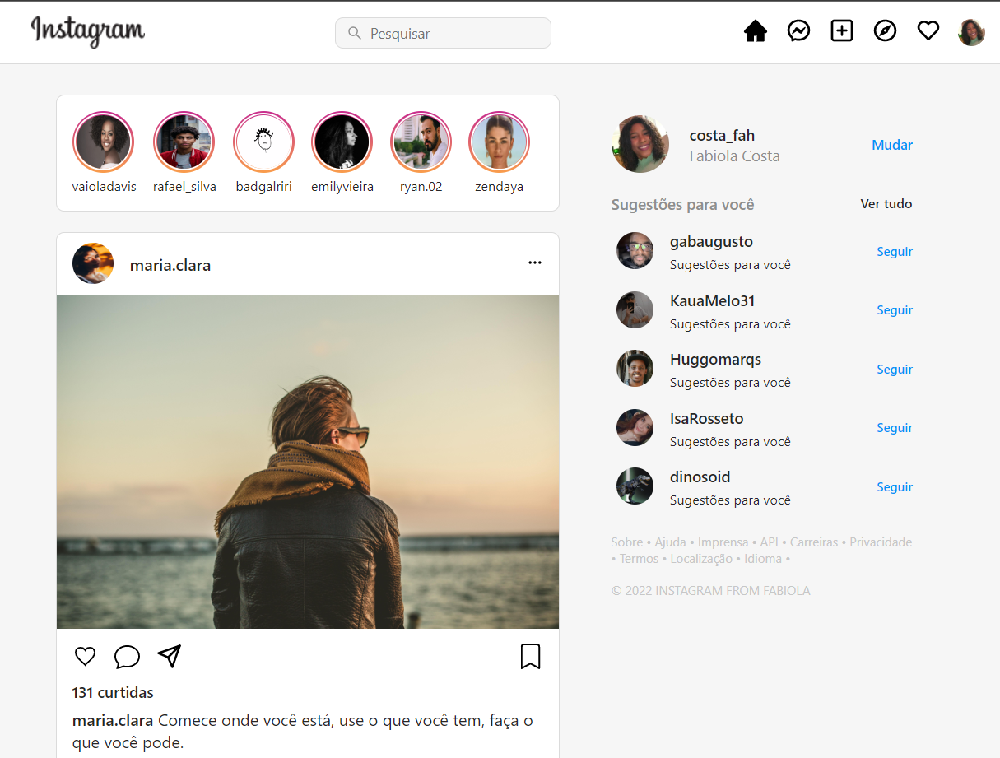

<h1 align='center'>Projeto Clone do Instagram</h1>
<h3>O objetivo desta atividade era replicar a inferface do instagram utilizando React.</h3> 

   

<h1 align='center'>Instruções para utilizar o projeto</h1>
<h3>1° Baixe todos os arquivos deste repositório</h3>
<h3>Depois de ter feito o download abra o terminal e utilize os comandos:</h3>

### `🔹cd <nome do projeto>`

### `🔹npm install` 

### `🔹npm start`
